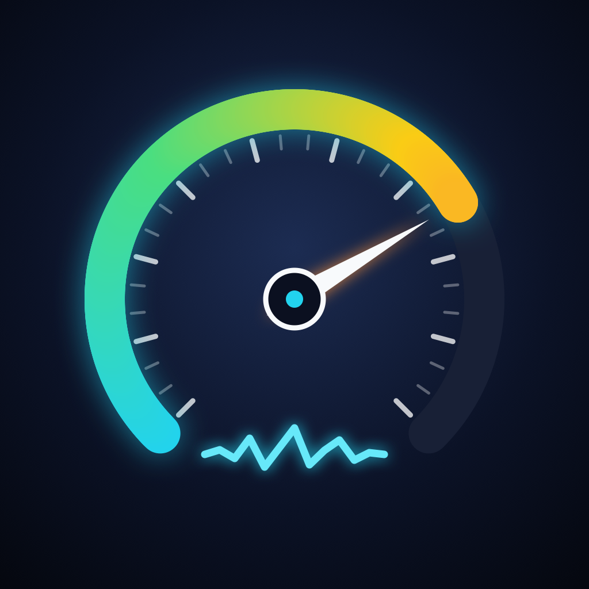

<p align="center">
  
</p>

# OBD Viewer Logger

BLE 接続の OBD2 ゲートウェイ（AsyncCAN-C3）から車両データを取得し、記録・確認するための iOS（iPhone / iPad）アプリです。SwiftUI・CoreBluetooth・Realm で作られています。

同じゲートウェイを使う M5Stack Tab5 版のモニターアプリの iOS 移植として作られました。

開発の経緯や設計については、こちらの記事で紹介しています。

- [車載CANロガーの作成](https://qiita.com/nak435/items/abb961a748de924bedb5)

## 主な機能

- 取得する PID（回転数・車速・ブースト圧・EGT・NOx など）を画面で選択
- ゲートウェイとの BLE 接続を自動維持。電波が届かなくなっても、範囲に戻れば操作なしで再接続
- アプリを閉じたり画面を消したりしても、バックグラウンドでロギングを継続
- 1 秒ごとに CoreLocation の緯度・経度を記録
- Realm にログを蓄積し、CSV でエクスポート（AirDrop 等で共有可能）
- アプリ自体の動作ログ（起動・接続・切断など）も記録し、CSV に混ぜて出力可能

## ビルド

`build.md` を参照してください。プロジェクトは [XcodeGen](https://github.com/yonaskolb/XcodeGen) の `project.yml` から生成します。

```bash
xcodegen generate
```

署名には自分の Apple Developer チーム ID が必要です。`project.yml` の `DEVELOPMENT_TEAM` はダミー値になっているため、ビルド時にコマンドラインで上書きしてください（`build.md` 参照）。

## 依存

- [Realm Swift](https://github.com/realm/realm-swift)（Swift Package Manager 経由）

## ライセンス

MIT License（`LICENSE` を参照）。
